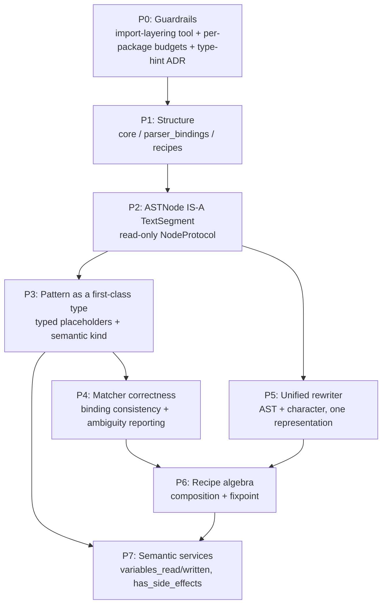

# Renaissance.Py improvement plan

A dependency-ordered roadmap for making Renaissance.Py the best platform for multi-language analysis and transformation of software.

This document is a proposal for discussion. It reorders the TODO list in [README.md](README.md) by dependency rather than by appetite,
and relates it to [issue 110](https://github.com/TNO/Renaissance.Py/issues/110) and [issue 187](https://github.com/TNO/Renaissance.Py/issues/187).

## The core observation

Most items on the TODO list are not independent. They all bottom out in three model defects.

1. **A node has no identity as a piece of text.**
   `TextSegment` exists in `src/renaissance/syntax_tree/text_segment.py`, but `NodeProtocol` does not extend it,
   and `ASTNode` carries its own mutable `_offset` and `_filename`.
   This is why the rewriter and the parser have different representations of the code,
   why character-based rewriting is bolted on, and why `reportUnknown*` dominates the lint budget
   (roughly 4000 of the tracked Pyright issues).
2. **A pattern is not a type.**
   A pattern is an `ASTNode` whose `$`-names are discovered by regular expression in `src/renaissance/utils/ast_utils.py`.
   This is why placeholders have no semantic kind, why binding consistency is an ad-hoc check inside `_resolve_match_one`,
   and why the matcher cannot *report* ambiguity.
3. **A recipe is not a value.**
   `RecipeASTProcessor` uses decorators (`@recipe_step`, `@after_step`) on a class.
   This is why there is no `RepeatUntilFixedPoint(recipe)`, no recursive find-and-replace,
   and no recipe-composes-recipe as required by issue 187.

Fixing these three turns roughly 70% of the TODO list into consequences rather than separate projects.

## Dependency graph



## Phase 0 - Make quality enforceable before moving anything

Small, pure wins. These come first because every later phase is validated by them.

- **Import-layering guard rail**, the "core is independent of all other code" tool.
  Write it now, against the current layout, as a test in `test/tools`.
  It immediately flags the two real violations: the late `cpp_utils` import in `src/renaissance/syntax_tree/__init__.py`
  and the `CPPPatternFactory` `TYPE_CHECKING` import in `src/renaissance/syntax_tree/ast_refactor_actions.py`.
  Those two violations become the acceptance criterion for phase 1.
- **Split `lint-budget.json` per package.**
  A single global budget means new `core/` code inherits a 9200-issue allowance.
  Per-package budgets allow declaring `core/` strict-clean with budget 0, while `parser_bindings/` burns down slowly.
  This is the highest-leverage change for the Ruff and Pyright goal; without it the counts will not converge.
- **Settle the `X | Sequence[X]` question as an ADR, not as a code change.**
  Recommendation: accept only `Sequence[X]` in core APIs.
  The union doubles the type checker's work at every call site, which is a large slice of the `reportUnknownArgumentType` count,
  and ergonomics are recoverable with a single `as_sequence()` normalizer at the boundary.
  Decide this before phase 2, because phase 2 touches every signature.

## Phase 1 - Structure, as pure moves

Adopt the issue 187 layout exactly, but mechanically, with zero semantic changes, so that reviewers can verify it is a rename.

```text
src/renaissance/core/              # was syntax_tree/ + common/ + utils/
src/renaissance/parser_bindings/   # was integrations/
src/renaissance/recipes/
test/unit/ test/feature/ test/e2e/ # kind at top level, src structure beneath
```

Two judgement calls on the open questions in issue 110.

- **`features/` moves under `test/`.**
  On the "kind-first versus structure-first" question: kind-first, as preferred in the issue.
  End-to-end tests genuinely have no `src` counterpart, and this keeps `pytest test/unit` fast.
- **`src/rejuvenation/` is not a package, it is a demo gallery.**
  Ten `*_example.py` files shipping inside a library is a liability.
  Move the examples to `examples/`, excluded from the distribution, keep only `src/rejuvenation/cli.py`
  and promote it to `src/renaissance/cli.py`.

Use deprecating re-export shims for one release so that downstream users are not broken.

## Phase 2 - ASTNode is a TextSegment, and the protocol becomes read-only

This is the keystone phase. Concretely:

- `NodeProtocol` extends `TextSegment`, so every node answers `full_text`, `start_offset`, `end_offset`, `start_line` and so on.
- All `NodeProtocol` members become read-only properties. Mutation becomes the rewriter's job,
  which is exactly the separation that issue 187 asks for.
- `ASTNode._offset`, `_filename`, `_parent` and `_children` stop being public mutable state.

Execute protocol-first: tighten `NodeProtocol`, let Pyright in strict mode report which of the six implementations break,
then fix them one parser binding per pull request.
Expect this phase to delete a large fraction of the `reportUnknownMemberType` debt as a side effect.
It is not a separate workstream.

## Phase 3 - Pattern as a first-class type

```python
class Pattern[N: NodeProtocol]:
    tree: N
    semantic_kind: SemanticKind        # what this pattern may match
    placeholders: Mapping[str, Placeholder]


class Placeholder:
    name: str
    pattern_kind: PatternKind          # MATCH_ONE | MATCH_ALL
    semantic_kind: SemanticKind        # fixes PatternFactory.create_statement("$placeholder")
```

Placeholders are discovered once, at pattern construction, inside the `PatternFactory`,
instead of being re-parsed by regular expression during every match attempt in `match_finder`.
This removes the `create_statement("$placeholder")` over-matching problem by construction:
the placeholder carries `STATEMENT`, so `node_kinds_match` rejects an expression.

## Phase 4 - Matcher correctness

With `Pattern` in place, `Variant.exp` becomes a typed `Bindings` object that owns the consistency rule.
The ambiguity requirement then becomes a feature of that object rather than a check scattered through the matcher.

- A re-binding of `$x` to a structurally equal but distinct node is recorded as an alternative binding, not silently accepted.
- `PatternMatch` gains `ambiguous_placeholders`, and `find_match` can be asked to fail loudly.

The identical-if-branches corner case described in the README then becomes a reported diagnostic
instead of something caught by an assertion downstream.

## Phase 5 - One representation for parser and rewriter

Phase 2 makes this almost mechanical.
If every node is a `TextSegment` over the same `full_text` bytes, then `Rewriter` in `src/renaissance/common/rewriter.py`
and `ASTRewriter` in `src/renaissance/syntax_tree/ast_rewriter.py` can collapse into a single rewriter
that accepts either a `TextSegment` range or a node.
That is precisely the "both AST-based and character-based rewriting" item.
The `Rewritable` protocol disappears, subsumed by `TextSegment`.

Drive this phase with the existing `@xfail_*` scenarios in `features/rewrite-semantics.feature` as the acceptance list.

## Phase 6 - Recipe algebra

Turn recipes into values.

```python
class Recipe(Protocol):
    def apply(self, unit: TranslationUnit) -> RewriteResult: ...


Sequence(r1, r2)            # composition
RepeatUntilFixedPoint(r)    # recursive find and replace falls out, per issue 187
```

Keep the decorator API as a thin adapter over this, so that existing recipes keep working.

Recursive find-and-replace is not a separate item.
It is `RepeatUntilFixedPoint(FindAndReplace(pattern, replacement))`.
Port the Renaissance-Ada convergence and iteration-cap semantics here;
the current `max_repeat=5` in `BatchASTProcessor` is the thing being generalized.

## Phase 7 - Semantic services

Introduce `variables_read`, `variables_written` and `has_side_effects` as core interfaces, implemented per parser binding.

This comes last because the interface shape depends on the node identity from phase 2 and the typed patterns from phase 3.
Ship the Python `ast` and Clang implementations; let tree-sitter raise `NotImplementedError`,
so that a recipe needing semantics fails loudly rather than silently mis-transforming.

## Recommended push-back

- **Do not treat "remove all Ruff and Pyright issues" as a phase.**
  At roughly 9200 issues it will never be scheduled, and done standalone it produces annotation churn with no design improvement.
  Phases 2 to 5 eliminate most of it structurally, and the per-package ratchet from phase 0 captures the gains.
  Only the residue deserves dedicated effort.
- **Do not combine phase 1 and phase 2.**
  A move-plus-redesign pull request is unreviewable, and it destroys the ability to distinguish a regression from a relocation.
- **The GDI tracing idea in issue 187** is a validation tool for the structure, not a driver of it.
  The import-layering checker in phase 0 gives most of that signal statically, today, for a fraction of the effort.

## Suggested first three pull requests

1. `lint-budget.json` split per package, with `core` declared strict at budget 0 once those two violations are fixed.
1. Two ADRs: "Sequence over union in core APIs" and "ASTNode is a TextSegment".
