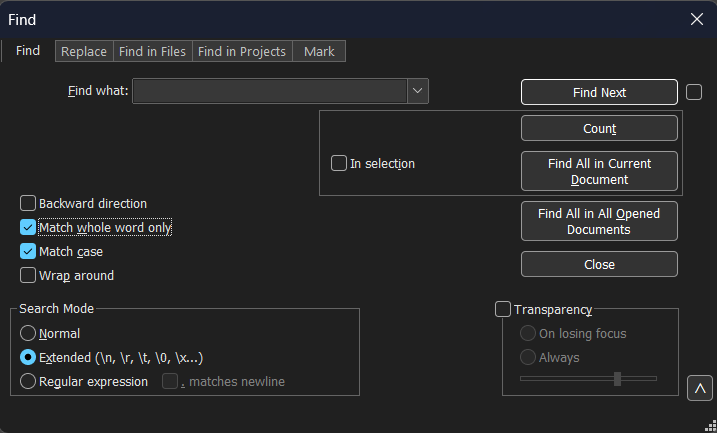

# Matching

**Stable ID:** `CONCEPT-MATCHING`

## Purpose
This document describes the concept of a match, i.e., when two objects are considered equal, 
and of finding matches that locates occurrences where this relation holds.

## 1.1 When do objects match?

The Cambridge dictionary describes match (_noun_) [EQUAL] as
> [a person or thing that is equal to another person or thing in strength, speed, or quality](https://dictionary.cambridge.org/dictionary/english/match).

Finding matches is not absolute but depends on the conceptual view of the objects.

For example, a conceptual view on text is defined by a set of dimensions, such as:
* **Granularity:** What is the smallest element? E.g., character or word.
* **Structure:** Is the text a flat sequence or a hierarchy, with chapters, sections, and paragraphs?
* **Classification:** What classes of elements exist? E.g., nouns, verbs, numbers, email addresses, exclamations, and questions.   
* **Equality:** When are two elements considered equal? E.g., is case relevant (e.g., `here`, `Here`, `HERE`)?

The different conceptual views lead to different matching outcomes. For example:
* `a` and `A` are different characters, but might represent the same letter.
* `here` and `there` are different words, but the sequence of characters `here` occurs within `there` under a character-based view.
* A chapter and a section might share the same title, e.g., `Introduction`.

[Table 1.1](#matching-table-text_examples) clearly illustrates the difference in finding matches, 
i.e., whether a needle occurs within a haystack, for several conceptual views.

<a name="matching-table-text_examples">

*Table 1.1: Examples of whether a match is present under several conceptual views of text.*

| conceptual view of text | `a` within `A` | `here` within `there` |
| ----------------------- | -------------- | --------------------- |
| sequence of characters  | no             | yes                   |
| sequence of letters     | yes            | yes                   |
| sequence of words       | no             | no                    |

</a>

Text editors provide options that influence matching, such as case sensitivity, whole-word matching, and pattern-based descriptions using regular expressions, which correspond respectively to the conceptual-view dimensions of equality, granularity, and classification.
See for example [Figure 1.1](#matching-equal-notepad++-find) that shows options supported by Notepad++.

<a name="matching-equal-notepad++-find">



*Figure 1.1 (CONCEPT-MATCHING): Selecting the desired conceptual view for text in the Find window of Notepad++.*

</a>

Code can be conceptually viewed as
* text,
* nested blocks indicated by matching delimiters, such as `{` `}`, `(` `)`, and `[` `]`, as is done by [comby](https://comby.dev/).
* Concrete Syntax Tree (CST) as is done by IDEs for editing and refactoring.
* Abstract Syntax Tree (AST) as is done by compilers.

### 1.2 Find matches based on classification

Matches can be found based on class. 
Each match found corresponds to an element belonging to that particular class.

For example, within a text one might find matches to: 
* numbers (e.g., `42`), 
* email addresses (e.g., `user@example.com`), and
* specific sentence classes, such as questions or exclamations.

Similarly, within source code one might find matches to:
* statements (e.g., `return 12;`), 
* if statements (e.g., `if (a > b) { max = a; } else { max = b; }`), 
* expressions (e.g., `a + b`), and
* declarations and definitions (e.g., variables, functions, and classes).

To support finding matches in a uniform way across different programming languages, 
it is necessary to abstract from language-specific and parser-specific details. 
Therefore, a generic classification is introduced that captures common programming concepts.
This generic classification includes elements such as declarations and definitions (of e.g., variables, functions, and classes), expressions, and statements.


## 1.3 Pattern matching

Matches can also be found based on a pattern.
A pattern can contain placeholders, also known as a meta variables, holes, or wildcards, to represent its variable parts.
A pattern can contain back references, either by name or position, to express constraints between parts of the pattern.
Each match found corresponds to an element that adheres to that pattern, i.e., the element is an instance of the pattern.
As in the previous sections, the result of pattern matching depends on the conceptual view, in particular on the chosen granularity, structure, classification, and equality.
The following subsections contain examples showing that different conceptual views may yield different matches on the same input.

### Regular-expression patterns

When code is viewed as a sequence of characters, patterns are typically expressed using regular expressions. For example, the regular-expression pattern `b.d` has one match within the text `abcde`, namely `bcd`.
Regular expressions allow matching based on character classes, such as `\d` for digits, and local structure.

The regular-expression pattern `MyPrint\([^)]*\)` finds two matches within the following code:
```
MyPrint()
MyPrint("Hello World")
```
that correspond to calls to the function `MyPrint`.
The same regular-expression pattern also yields two matches within the following code:
```
MyPrint(name, "is", age, "years (old).")
MyPrint((a+12) * matrix[0][1])
```
However, the matches — `MyPrint(name, "is", age, "years (old)` and `MyPrint((a+12)` — do not correspond to function calls. 

The inability to capture all function calls is not specific to this particular pattern, but reflects a fundamental limitation of regular expressions.
Regular expressions lack the expressive power to represent unbounded hierarchical structure.
Consequently, regular expressions cannot match arbitrarily deep nesting of balanced delimiters, such as parentheses, quotes, brackets, and braces.

### Structure-based patterns
When code is viewed as structured by delimiters, equality should respect this structure. 
[Comby](https://comby.dev), for example, matches the structure-based pattern `MyPrint(:[arguments])` to calls to the function `MyPrint`.
The placeholder `:[arguments]` represents a sequence of characters with properly balanced delimiters. 
The following code contains three matches of this structure-based pattern:
```
MyPrint()
MyPrint("Hello Word")
MyPrint(name, "is", age, "years (old).")
```
<!---
Should the example have unbalanced delimiters within a literal text string? 
-->
The matching is language-agnostic and can handle arbitrarily deep nesting of delimiters. However, the matching does not capture the internal structure of the arguments, such as their number or types.

### AST-based patterns
When code is viewed as an Abstract Syntax Tree (AST), patterns operate on syntactic structure rather than on text.
For example, the AST-based pattern `MyPrint($argument)` matches calls to the function `MyPrint` with exactly one argument.
The placeholder `$argument` represents one AST node.
This AST-based pattern has no match within:
```
MyPrint()
MyPrint(name, "is", age, "years (old).")
```
and two matches within:
```
MyPrint("Hello Word")
MyPrint((a+12) * matrix[0][1])
```

AST-based patterns respect the grammar of the language and distinguish syntactic constructs precisely. However, they do not account for semantic properties, such as the type of an argument.
Consequently, AST-based patterns cannot distinguish between the distinct overloads of a function, e.g., `MyPrint(string)` and `MyPrint(int)` in the previous example.


## 2. Pattern language

### 2.1 Concrete syntax
Patterns may use ordinary source notation already known to developers.

### 2.2 Groups, placeholders, and holes
- single placeholder: `$x`
- multi placeholder: `$$xs`

### 2.3 Matching constraints inside a pattern
Repeated occurrences of the same placeholder act as a back-reference style constraint.

## 3. Nested matches
- nested `if` statements and `for` loops in code
- nested parentheses such as `(a(b(c)))` in text-like structures

## 4. Multi-matches
Patterns can admit more than one valid decomposition, for example:

```text
f($$before, $arg, $$after)
```

Relevant strategies include eager, lazy, and all-possible matching.

## 5. Matching criteria
- full
- prefix
- anywhere
- first, next, and all

## Related images
- Local image directory: [matching/](matching/README.md)
