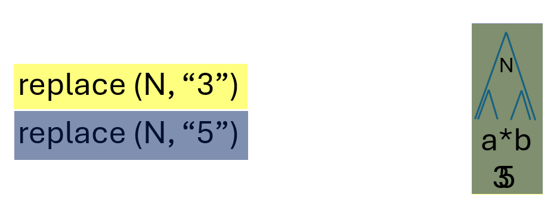
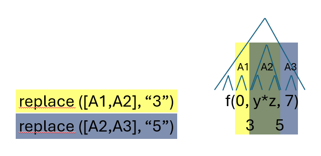
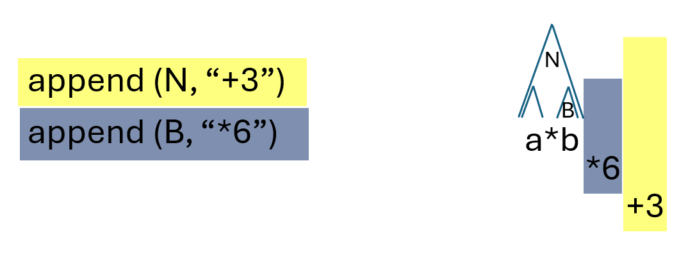

{ #concept-rewrite-semantics }
# Rewrite semantics

**Stable ID:** `CONCEPT-REWRITE-SEMANTICS`

## Purpose
Define predictable and understandable semantics for collected and committed changes.

## Kind of changes

We distinguish two kinds of changes: Replacements and insertions.

Each replacement affects a range within the original text. 
In AST-based pattern matching that range of text corresponds to either an AST node or a sequence of consecutive sibling nodes.
A removal is `just` a replacement with an empty string. 

Each insertion relates to a location in the original text.
In AST-based pattern matching that location of text corresponds to either the start location or the end location of an AST node.
Three kind of insertions are supported, i.e., prepend, append, and around, that insert text at the start, end, and both locations of the AST node.

## Rewrite step

Each rewrite step consists of the following, sequential steps:
1. parse code,
1. collect changes, and
1. commit changes.

## Particular combinations

We have the following rules to combine and commit the collected changes.

1. Replacements affecting the same AST node(s) are erroneous.

Whenever different changes are applied to the same range of text, an error will be raised.
For AST-based pattern matching, this situation can only occur when replacements are applied to the same node or to the same sequence of nodes.
So when multiple replacements are affecting the same AST node(s) an error is raised.

Figure 1.1 shows an example where different replacements are applied to the same AST node.

<a name="rewrite-semantics-equal">

*Figure 1.1 (CONCEPT-REWRITE-SEMANTICS-EQUAL): Example of multiple replacements to the same AST node.*

</a>

2. Overlapping replacements are erroneous.

Whenever different changes are applied to overlapping ranges of text, an error will be raised.
For AST-based pattern matching, this situation can only occur when replacements are applied to overlapping sequence of nodes.
So when multiple replacements are affecting the same sequence of AST nodes an error is raised.

Figure 1.2 shows an example where replacements are applied to overlapping sequences of arguments to a function call in which case an error is raised.

<a name="rewrite-semantics-overlap">

*Figure 1.2 (CONCEPT-REWRITE-SEMANTICS-OVERLAP): Example of overlapping replacements.*

</a>

3. Dominated changes are ignored.

A change is dominated if its range is a proper subset of the range of another change.
For AST-based pattern matching this may occur when a change associated with an AST node lies within the range of a change associated with one of its ancestors. 

<a name="rewrite-semantics-dominated">

*Figure 1.3 (CONCEPT-REWRITE-SEMANTICS-DOMINATED): Example of a dominated change.*

</a>

4. Multiple prepends at the same text location

* different nodes

    Prepend of ancestor before prepend of descendant.

    <a name="rewrite-semantics-prepends">

    

    *Figure 1.3 (CONCEPT-REWRITE-SEMANTICS-PREPENDS): Example of prepends of different AST nodes at the same textual location.*

    </a>
    
    * same node
        In order of insertion of change

5. Multiple appends at the same text location
    * different nodes
    
      Append of ancestor after append of descendant.

      <a name="rewrite-semantics-prepends">

    

    *Figure 1.4 (CONCEPT-REWRITE-SEMANTICS-APPENDS): Example of appends of different AST nodes at the same textual location.*

    </a>
    
    * same node

        In reverse order of insertion of change

6. Appends and prepends at the same text location
        Can only happen for consecutive sibling nodes
        append of sibling before prepend of next, consecutive sibling

    <a name="rewrite-semantics-append-prepend">

    

    *Figure 1.5 (CONCEPT-REWRITE-SEMANTICS-APPEND-PREPEND): Example of append and prepend of adjacent siblings at the same textual location.*

    </a>

7. Prepend, surround, and append
    * same node
        The expected order in the modified source file is:

        prepend_text, surround_before_text, AST Node text, surround_after_text, append_text
