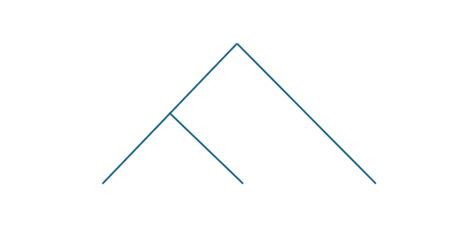

{ #feature-rewrite-semantics }
# Rewrite semantics

**Stable ID:** `FEATURE-REWRITE-SEMANTICS`

## Purpose
Define predictable and understandable semantics for collected and committed changes.

# Corner case: Covered, overlapping replacements

Covered changes are hidden.
Overlapping replacements are considered an error.
An error should be raised even when the overlapping replacements are covered,
and thus, as they are hidden, not observable in the modified source file.   

# Corner case: Identical changes

The behaviour of identical changes is as follows:
* Removing the same AST node more than once is considered an error.
* Replacing the same AST node more than once is considered an error, even when the replacement text is the same.
* Applying append, prepend and around multiple times with the same text, results in multiple inserts of the same text.

## Corner cases for test the rewrite seamatics

1. AST node spanning the whole file, i.e., the complete range.
2. AST beginning at the start of the file, i.e., the range starts at the first character.
3. AST stopping at the end of the file, i.e., the range ends at the last character.
   Last character might be End-Of-File (`EOF`) instead End-Of-Line (`EOL`). 

# Scenario: Covered changes

<a name="rewrite-semantics-cover">

*Figure 1.3 (CONCEPT-REWRITE-SEMANTICS-COVER): Example of overlapping sequences of AST nodes.*

</a>

**Description**: Replacements hide covered changes

BDD keyword | step description
-- | --
Given | a   programming language
and | a   source file written in that programming language
and | an AST   extracted from that source file without errors
and | a node   of that AST
and | a sequence of descendant nodes of that node
When | that node is replaced by a text
and | Rewrites,   i.e., append, prepend, around, and replace, are performed on that sequence of descendant nodes
Then | in the modified source file that node is replaced by the given text and all rewrites   on that sequence of descendant nodes are not performed / hidden

TODO: This description is only valid when a node is NOT considered a decendant of itself.
Check our definition (and implementation)!

# Scenario: Overlapping changes

<a name="rewrite-semantics-overlap">

*Figure 1.2 (CONCEPT-REWRITE-SEMANTICS-OVERLAP): Example of overlapping replacements.*

</a>

**Description**: Replacements (including removal) cannot overlap

BDD keyword | step description
-- | --
Given 	| a programming language
and	| a source file written in that programming language
and	| an AST extracted from that source file without errors
and	| two sequences of nodes of that AST that partly overlap
When 	| both sequences are replaced with a string
Then 	| an error with the text "overlapping changes are forbidden" is produced   

# Scenario: Combination of prepend and around

Three cases
1. on the same node
2. on a node and a descendant of that node
3. on unrelated nodes

## Case 1
Prepend before around

## Case 2
* Around of node always before prepend of descendant of that node
* Prepend of node always before around of descendant of that node

## Case 3
No interaction possible, so nothing to specify

# Scenario: Combination of append and around

Three cases
1. on the same node
2. on a node and a descendant of that node
3. on unrelated nodes

## Case 1
Append after around

## Case 2
* Around of node always after append of descendant of that node
* Append of node always after around of descendant of that node

## Case 3
No interaction possible, so nothing to specify

# Scenario: Combination of multiple prepends

Three cases
1. on the same node
2. on a node and a descendant of that node
3. on unrelated nodes

## Case 1

In the order of prepending. 
Final order in modified source file: Prepend N - ... -  Prepend 2 - Prepend 1 - AST Node

## Case 2

<a name="rewrite-semantics-prepends-shared-text-location">

*Figure 1.? (CONCEPT-REWRITE-SEMANTICS-PREPEND): Example of overlapping replacements.*

</a>

BDD keyword | step description
-- | --
Given 	| a programming language
and	| a source file written in that programming language
and	| a string not contained in that source file
and	| an AST extracted from that source file without errors
and	| a node of that AST
and	| a descendant of that node
When 	| that node is prepended by a concatenation of that string with "node"
and	| that descendant is prepended by a concatenation of that string with "descendant"
Then 	| in the modified source file the concatenation of that string with "node" occurs before the concatenation of that string with "descendant"  

Discussion:
* Alternative for then step: In the transformed source file the concatenation prepended before that node occurs before the concatenation prepended before that descendant

# Scenario: Combination of multiple appends

Three cases
1. on the same node
2. on a node and a descendant of that node
3. on unrelated nodes

## Case 1

In the order of appending. 
Final order in modified source file: AST Node - Append 1 - Append 2 - ... - Append N

## Case 2

BDD keyword | step description
-- | --
Given 	| a programming language
and	| a source file written in that programming language
and	| a string not contained in that source file
and	| an AST extracted from that source file without errors
and	| a node of that AST
and	| a descendant of that node
When 	| that node is append by a concatenation of that string with "node"
and	| that descendant is appended by a concatenation of that string with "descendant"
Then 	| in the modified source file the concatenation of that string with "node" occurs after the concatenation of that string with "descendant"  

# Scenario: Combination of multiple arounds

Around has before and after text.

Three cases
1. on the same node
2. on a node and a descendant of that node
3. on unrelated nodes

## Case 1

The order reflects the order of calling around. 
Final order in modified source file: 
Around Before N - ... - Around Before 2 - Around Before 1 - AST Node - Around After 1 - Around After 2 - ... - Around After N

## Case 2

### Example
Given the addition `a + b` and two changes
1. the variable `a` should be wrapped in a call to `abs`, i.e., surrounded by `abs(` and `)`
2. the addition should be wrapped in a call to `exp`, i.e., surrounded by `exp(` and `)`

Note that both the variable `a` and the addition start at the same position in the source code. 

The expected output is `exp(abs(a) + b)` and NOT `abs(exp(a) + b)`.

# Scenario: Combination of append and prepend on consecutive nodes

<a name="rewrite-semantics-append-prepend-shared-text-location">

*Figure 1.? (CONCEPT-REWRITE-SEMANTICS-APPEND_PREPEND): Example of overlapping replacements.*

</a>

BDD keyword | step description
-- | --
 Given 	| a programming language
and	| a source file written in that programming language
and	| a string not contained in that source file
and	| an AST extracted from that source file without errors
and	| two consecutive nodes of that AST
When 	| the first node is append by a concatenation of that string with "node"
and	| the second node is prepended by a concatenation of that string with "descendant"
Then 	| in the modified source file the concatenation of that string with "node" occurs before the concatenation of that string with "descendant"

### Example
Given the two statements in C++ `i++;++j;` and two changes
1. Append to each statement of a postfix increment operator, the comment `/* postfix increment */`
2. Prepend to each statement of a prefix increment operator, the comment `/* prefix increment */`

Note that the statement `i++;` ends and the statement `++j;` starts at the same position in the source code.

The expected output is `i++;/* postfix increment *//* prefix increment */++j;` and NOT `i++;/* prefix increment *//* postfix increment */++j;`.
 
