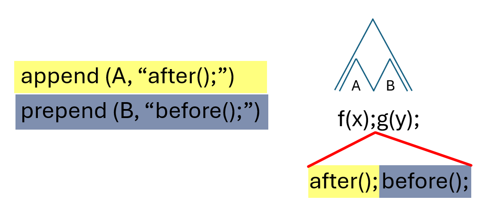

{ #feature-rewrite-semantics }
# Rewrite semantics

**Stable ID:** `FEATURE-REWRITE-SEMANTICS`

## User-facing summary
The rewrite semantics feature governs how multiple collected changes — replacements and insertions — are applied to a source file in a single rewrite step. It defines which combinations are valid and which produce errors, so that transformation authors can reason about the outcome of composing changes.

## Related concepts
- [Rewrite semantics](../concepts/rewrite-semantics.md)

## Verified by test modules
- [Rewrite semantics test module](../../developer/modules/rewrite-semantics.md)
- BDD scenarios: `features/rewrite-semantics.feature`
- BDD steps: `features/steps/test-rewrite-semantics.py`

# Corner case: Dominated, overlapping replacements

When a replacement is dominated by another replacement, it is excluded from the
result — as if it were never collected. However, it is still checked for
overlaps with other changes. An overlap among dominated replacements therefore
still produces an error.

See [Architecture: rewrite semantics](../../developer/architecture/rewrite-semantics.md) for the rationale behind this choice.

# Scenario: Dominated changes

See [Figure 1.3 in the concept page](../concepts/rewrite-semantics.md#rewrite-semantics-dominated) for an illustration.

**Description**: Replacements hide dominated changes

BDD keyword | step description
-- | --
Given | a   programming language
and | a   source file written in that programming language
and | an AST   extracted from that source file without errors
and | a node   of that AST
and | a sequence of descendant nodes of that node
When | that node is replaced by a text
and | Rewrites,   i.e., append, prepend, surround, and replace, are performed on that sequence of descendant nodes
Then | in the modified source file that node is replaced by the given text and all rewrites   on that sequence of descendant nodes are not performed / hidden

TODO: This description is only valid when a node is NOT considered a descendant of itself.
Check our definition (and implementation)!

# Scenario: Overlapping changes

See [Figure 1.2 in the concept page](../concepts/rewrite-semantics.md#rewrite-semantics-overlap) for an illustration.

**Description**: Replacements (including removal) cannot overlap

BDD keyword | step description
-- | --
Given     | a programming language
and    | a source file written in that programming language
and    | an AST extracted from that source file without errors
and    | two sequences of nodes of that AST that partly overlap
When     | both sequences are replaced with a string
Then     | an error with the text "overlapping changes are forbidden" is produced   

# Scenario: Combination of prepend and surround

Three cases
1. on the same node
2. on a node and a descendant of that node
3. on unrelated nodes

## Case 1
Prepend before surround

## Case 2
* Surround of node always before prepend of descendant of that node
* Prepend of node always before surround of descendant of that node

## Case 3
No interaction possible, so nothing to specify

# Scenario: Combination of append and surround

Three cases
1. on the same node
2. on a node and a descendant of that node
3. on unrelated nodes

## Case 1
Append after surround

## Case 2
* surround of node always after append of descendant of that node
* Append of node always after surround of descendant of that node

## Case 3
No interaction possible, so nothing to specify

# Scenario: Combination of multiple prepends

Three cases
1. on the same node
2. on a node and a descendant of that node
3. on unrelated nodes

## Case 1

In the order of prepending. 
Final order in modified source file: Prepend N - ... -  Prepend 2 - Prepend 1 - AST Node

## Case 2

See the concept page for an illustration of [prepends at the same text location](../concepts/rewrite-semantics.md#rewrite-semantics-prepends).

</a>

BDD keyword | step description
-- | --
Given     | a programming language
and    | a source file written in that programming language
and    | a string not contained in that source file
and    | an AST extracted from that source file without errors
and    | a node of that AST
and    | a descendant of that node
When     | that node is prepended by a concatenation of that string with "node"
and    | that descendant is prepended by a concatenation of that string with "descendant"
Then     | in the modified source file the concatenation of that string with "node" occurs before the concatenation of that string with "descendant"  

# Scenario: Combination of multiple appends

Three cases
1. on the same node
2. on a node and a descendant of that node
3. on unrelated nodes

## Case 1

In the order of appending. 
Final order in modified source file: AST Node - Append 1 - Append 2 - ... - Append N

## Case 2

BDD keyword | step description
-- | --
Given     | a programming language
and    | a source file written in that programming language
and    | a string not contained in that source file
and    | an AST extracted from that source file without errors
and    | a node of that AST
and    | a descendant of that node
When     | that node is append by a concatenation of that string with "node"
and    | that descendant is appended by a concatenation of that string with "descendant"
Then     | in the modified source file the concatenation of that string with "node" occurs after the concatenation of that string with "descendant"  

# Scenario: Combination of multiple surrounds

Surround has before and after text.

Three cases
1. on the same node
2. on a node and a descendant of that node
3. on unrelated nodes

## Case 1

The order reflects the order of calling surround. 
Final order in modified source file: 
Surround Before N - ... - Surround Before 2 - Surround Before 1 - AST Node - Surround After 1 - Surround After 2 - ... - Surround After N

## Case 2

### Example
Given the addition `a + b` and two changes
1. the variable `a` should be wrapped in a call to `abs`, i.e., surrounded by `abs(` and `)`
2. the addition should be wrapped in a call to `exp`, i.e., surrounded by `exp(` and `)`

Note that both the variable `a` and the addition start at the same position in the source code. 

The expected output is `exp(abs(a) + b)` and NOT `abs(exp(a) + b)`.

# Scenario: Combination of append and prepend on consecutive nodes

<a name="rewrite-semantics-append-prepend-shared-text-location">

*Figure 1.? (CONCEPT-REWRITE-SEMANTICS-APPEND_PREPEND): Example of overlapping replacements.*

</a>

BDD keyword | step description
-- | --
 Given     | a programming language
and    | a source file written in that programming language
and    | a string not contained in that source file
and    | an AST extracted from that source file without errors
and    | two consecutive nodes of that AST
When     | the first node is append by a concatenation of that string with "node"
and    | the second node is prepended by a concatenation of that string with "descendant"
Then     | in the modified source file the concatenation of that string with "node" occurs before the concatenation of that string with "descendant"

### Example
Given the two statements in C++ `i++;++j;` and two changes
1. Append to each statement of a postfix increment operator, the comment `/* postfix increment */`
2. Prepend to each statement of a prefix increment operator, the comment `/* prefix increment */`

Note that the statement `i++;` ends and the statement `++j;` starts at the same position in the source code.

The expected output is `i++;/* postfix increment *//* prefix increment */++j;` and NOT `i++;/* prefix increment *//* postfix increment */++j;`.
 
