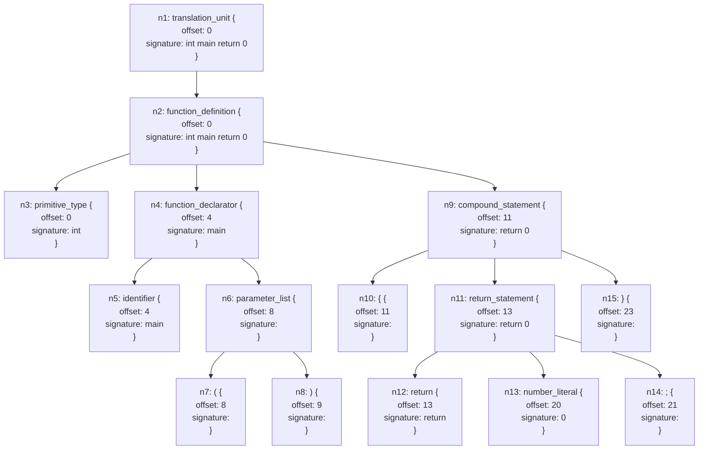

```mermaid
graph TD
n1["n1: translation_unit {<br>offset: 0<br>signature: int main  return 0 <br>}"]
n2["n2: function_definition {<br>offset: 0<br>signature: int main  return 0 <br>}"]
n3["n3: primitive_type {<br>offset: 0<br>signature: int<br>}"]
n2 --> n3
n4["n4: function_declarator {<br>offset: 4<br>signature: main<br>}"]
n5["n5: identifier {<br>offset: 4<br>signature: main<br>}"]
n4 --> n5
n6["n6: parameter_list {<br>offset: 8<br>signature: <br>}"]
n7["n7: ( {<br>offset: 8<br>signature: <br>}"]
n6 --> n7
n8["n8: ) {<br>offset: 9<br>signature: <br>}"]
n6 --> n8
n4 --> n6
n2 --> n4
n9["n9: compound_statement {<br>offset: 11<br>signature:  return 0 <br>}"]
n10["n10: { {<br>offset: 11<br>signature: <br>}"]
n9 --> n10
n11["n11: return_statement {<br>offset: 13<br>signature: return 0<br>}"]
n12["n12: return {<br>offset: 13<br>signature: return<br>}"]
n11 --> n12
n13["n13: number_literal {<br>offset: 20<br>signature: 0<br>}"]
n11 --> n13
n14["n14: ; {<br>offset: 21<br>signature: <br>}"]
n11 --> n14
n9 --> n11
n15["n15: } {<br>offset: 23<br>signature: <br>}"]
n9 --> n15
n2 --> n9
n1 --> n2
```