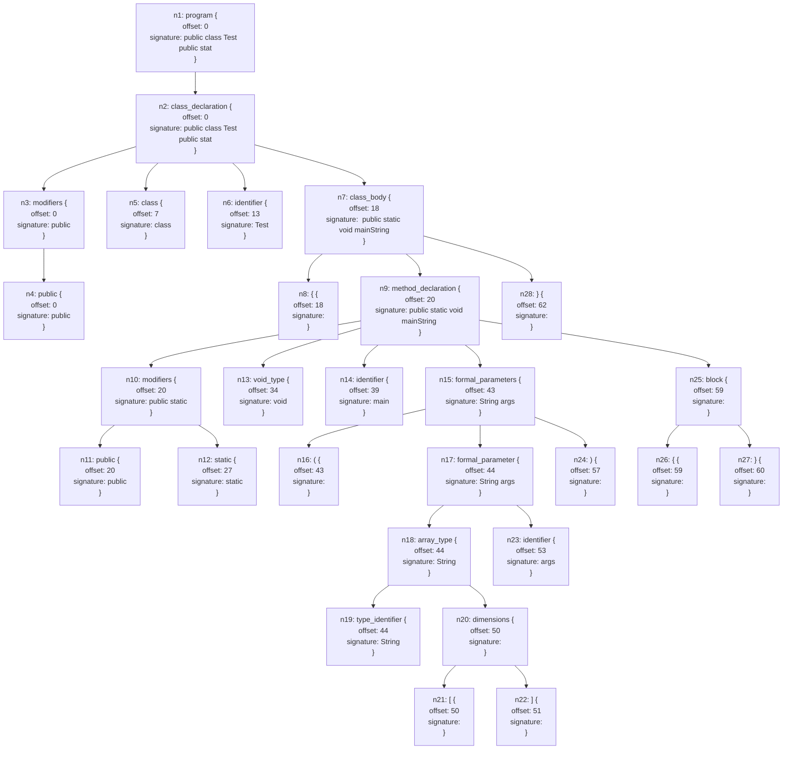

```mermaid
graph TD
n1["n1: program {<br>offset: 0<br>signature: public class Test  public stat<br>}"]
n2["n2: class_declaration {<br>offset: 0<br>signature: public class Test  public stat<br>}"]
n3["n3: modifiers {<br>offset: 0<br>signature: public<br>}"]
n4["n4: public {<br>offset: 0<br>signature: public<br>}"]
n3 --> n4
n2 --> n3
n5["n5: class {<br>offset: 7<br>signature: class<br>}"]
n2 --> n5
n6["n6: identifier {<br>offset: 13<br>signature: Test<br>}"]
n2 --> n6
n7["n7: class_body {<br>offset: 18<br>signature:  public static void mainString<br>}"]
n8["n8: { {<br>offset: 18<br>signature: <br>}"]
n7 --> n8
n9["n9: method_declaration {<br>offset: 20<br>signature: public static void mainString <br>}"]
n10["n10: modifiers {<br>offset: 20<br>signature: public static<br>}"]
n11["n11: public {<br>offset: 20<br>signature: public<br>}"]
n10 --> n11
n12["n12: static {<br>offset: 27<br>signature: static<br>}"]
n10 --> n12
n9 --> n10
n13["n13: void_type {<br>offset: 34<br>signature: void<br>}"]
n9 --> n13
n14["n14: identifier {<br>offset: 39<br>signature: main<br>}"]
n9 --> n14
n15["n15: formal_parameters {<br>offset: 43<br>signature: String args<br>}"]
n16["n16: ( {<br>offset: 43<br>signature: <br>}"]
n15 --> n16
n17["n17: formal_parameter {<br>offset: 44<br>signature: String args<br>}"]
n18["n18: array_type {<br>offset: 44<br>signature: String<br>}"]
n19["n19: type_identifier {<br>offset: 44<br>signature: String<br>}"]
n18 --> n19
n20["n20: dimensions {<br>offset: 50<br>signature: <br>}"]
n21["n21: [ {<br>offset: 50<br>signature: <br>}"]
n20 --> n21
n22["n22: ] {<br>offset: 51<br>signature: <br>}"]
n20 --> n22
n18 --> n20
n17 --> n18
n23["n23: identifier {<br>offset: 53<br>signature: args<br>}"]
n17 --> n23
n15 --> n17
n24["n24: ) {<br>offset: 57<br>signature: <br>}"]
n15 --> n24
n9 --> n15
n25["n25: block {<br>offset: 59<br>signature: <br>}"]
n26["n26: { {<br>offset: 59<br>signature: <br>}"]
n25 --> n26
n27["n27: } {<br>offset: 60<br>signature: <br>}"]
n25 --> n27
n9 --> n25
n7 --> n9
n28["n28: } {<br>offset: 62<br>signature: <br>}"]
n7 --> n28
n2 --> n7
n1 --> n2
```