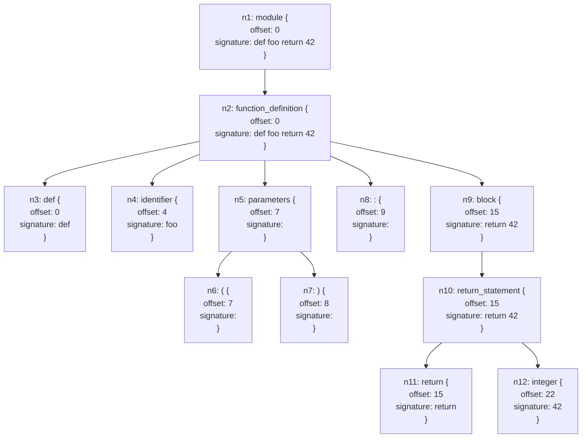

```mermaid
graph TD
n1["n1: module {<br>offset: 0<br>signature: def foo     return 42<br>}"]
n2["n2: function_definition {<br>offset: 0<br>signature: def foo     return 42<br>}"]
n3["n3: def {<br>offset: 0<br>signature: def<br>}"]
n2 --> n3
n4["n4: identifier {<br>offset: 4<br>signature: foo<br>}"]
n2 --> n4
n5["n5: parameters {<br>offset: 7<br>signature: <br>}"]
n6["n6: ( {<br>offset: 7<br>signature: <br>}"]
n5 --> n6
n7["n7: ) {<br>offset: 8<br>signature: <br>}"]
n5 --> n7
n2 --> n5
n8["n8: : {<br>offset: 9<br>signature: <br>}"]
n2 --> n8
n9["n9: block {<br>offset: 15<br>signature: return 42<br>}"]
n10["n10: return_statement {<br>offset: 15<br>signature: return 42<br>}"]
n11["n11: return {<br>offset: 15<br>signature: return<br>}"]
n10 --> n11
n12["n12: integer {<br>offset: 22<br>signature: 42<br>}"]
n10 --> n12
n9 --> n10
n2 --> n9
n1 --> n2
```